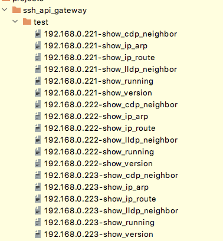

<strong>
 API SSH Gateway
 </strong>

The API SSH gateway was primarily written to work with Cisco networking devices. As most networking devices don’t have API interfaces, access is mainly restricted to SSH or overly complex Netconf which uses YANG. 

The CLI holds a wealth of information but getting access to this information (quickly and at scale) can be a challenge. Once the SSH API server is online (SSH sessions are established), an API call is sent to the API interface which relays an incoming request (embedded within the JSON) into a queuing agent. The queuing agent is responsible for queuing and responding to each API request. 

Having all SSH sessions permanently connected has its advantages. The most noteworthy is no setup lag. This reduces the delay from receiving the API call, setting up each SSH session and then responding. As there is only one established SSH session (per device), only one API call can be processed at any time. If multiple requests are received, they are processed in a first come, first serve basis.

The API SSH gateway is built using threading. Once SSH sessions are established, they remain active. If a SSH session drops or is disconnected, the API SSH gateway will try and reestablish it. To stop the SSH sessions from going stale, every 5 seconds, the server will press enter on the remote device. If an API request arrives for a device which is not established then the result will say “SSH session not established’. For example, if 2 out of 50 devices are offline, the offline devices are skipped, results will be seen from the other 48 and an error for the skipped two. 

For simplicity, I’ve created a tool which parses YAML. An example of the YAML structure is found in the repo (named test.yaml). The fetch.py file is responsible for parsing the YAML file, creating the JSON, sending the API, receiving the results and writing the results to the output folder. 

Folder contents

There are a number of files found in the root folder. These are:

•	ssh_api.py: the front end python code (flask and args). 
•	ssh.py:  backend processing of the API call (netmiko/threading). 
•	authentication_module.py: location of the API username and password. Could you expanded to use LDAP or some other authentication method.  
•	device_cfg.txt: a list of your SSH devices (either IP or Name) 
•	auth_file.txt (optional): stores the SSH username, password and server API key (or use input arguments) 
•	server_cfg.txt, server related configuration (http/https, API IP Address and port) 
•	cert/key for testing HTTPS 
•	remote_management.py: check status, start or stop the SSH service.  
•	fetch.py: Used to initiate an API call using an YAML file 

Python Libraries

I have created this code using Python 3.9 and the following libraires

•	Netmiko
•	Flask
•	ConfigParser
•	argparse
•	pprint
•	json
•	requests
•	urllib3
•	pyyaml (yaml)

API Username and Password

I have added a file called authentication_module.py which is imported during startup. This file contains a static username and password however, this could easily be integrated into LDAP (and should be) if used in a production network. 

Server setup

The server can be setup using three different methods:

1)	Using the setup wizard. No information is saved
2)	Using the server_cfg.txt file plus either auth_file.txt
3)	entered authentication arguments. 

Arguments

  -h, --help          		show this help message and exit 
  -auth_cfg           		uses local cred file 
  -username USERNAME  	ssh username 
  -password PASSWORD 	ssh password 
  -api_key API_KEY    	API Key, minimum 10 characters 
  -wizard             		enter setup wizard mode

When -auth_cfg flag is entered, the auth_cfg.txt file is used. If neither the -wizard or -auth_cfg flag is flagged then -username, -password and -api_key must be provided.

Example using arguments:

python3 ssh_api.py -username admin -password cisco -api_key 5544332233444

Once the server starts, onscreen updates will be provided. 

Example using auth_file.txt

python3 ssh_api.py -auth_cfg

Server establishing SSH sessions

SSH session 192.168.0.221 now established, now waiting for a job to arrive
{'192.168.0.223': False, '192.168.0.221': True, '192.168.0.222': False}

SSH session 192.168.0.222 now established, now waiting for a job to arrive
{'192.168.0.223': False, '192.168.0.221': True, '192.168.0.222': True}

SSH session 192.168.0.223 now established, now waiting for a job to arrive
{'192.168.0.223': True, '192.168.0.221': True, '192.168.0.222': True}

True states that the SSH session is established, False is not established

From the console, there are four control options

please select either start,status,stop or terminate:

•	Start: this happens automatically during setup
•	Stop: Graceful shutdown of all SSH sessions
•	Terminate: Graceful shutdown of all SSH session then terminates the server
•	Status: request SSH status

All actions (except terminate) are available when using remote_management.py

python3 remote_management.py -status

{'response': {'192.168.0.221': False,
              '192.168.0.222': False,
              '192.168.0.223': False}}

python3 remote_management.py -start
{'response': {'192.168.0.221': True,
              '192.168.0.222': True,
              '192.168.0.223': True}}

python3 remote_management.py -stop
{'response': {'192.168.0.221': False,
              '192.168.0.222': False,
              '192.168.0.223': False}}

Now that the server is up and the SSH sessions are established, it's time to pull some data. 

python3 fetch.py test.yaml or python3 fetch.py test are acceptable. 

ERROR 192.168.0.220: No SSH Threader found
ERROR 192.168.0.224: No SSH Threader found

Both 192.168.0.220 and .224 are configured in the YAML however, they are not online. 

 

  

